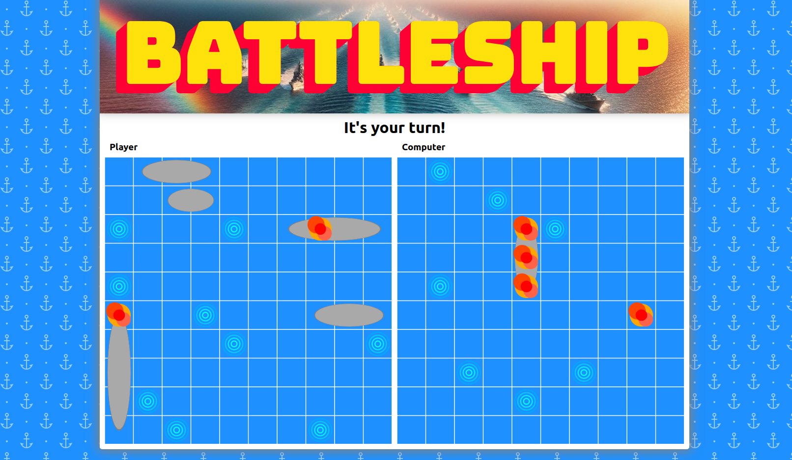

# Battleship project

This is a Website to play the game Battleship. It's written in plain HTML, CSS and Javascript. The website is responsive and works for desktop and mobile.

## Features

- Play Battleship against the computer

## Planned Features

- Make the computer smarter
- Persistence between game sessions by using localStorage
- Place ships with Drag&Drop before starting a game
- Play against other players by implementing a backend

## How to run

The website can be run with npm scripts from the project root directory and Webpack and Webpack DevServer are used for bundling and development (see package.json for details).

### Prerequisites
Node.js and npm (Node Package Manager) have to be installed (I used Node.js 20).

For Windows or Mac visit https://nodejs.org/en and follow the instructions.

For Linux you can use nvm (Node Version Manager, https://github.com/nvm-sh/nvm) to install and manage Node and npm versions.

When using the project for the first time you have to run `npm install` from the project root directory to install dependencies which are defined in the package.json.

### Scripts

For development execute:

    npm run dev

To build the website for production execute:

    npm run build

Tests are written with Jest and can be run with:

    npm run test

## Code
The source code is separated into model and view which communicate via a message broker as a mediator (Publish-Subscribe pattern).  `index.js` is the entrypoint where view and model get initialized. The message broker in `message-broker.js` is directly imported into the view and model modules as a global singleton.

## Tools

Webpack 5 is used for processing the source code and the assets (See `webpack.config.js`). It uses Babel for transpiling the JS. The output directory is `dist`. HTMLWebpackPlugin generates `dist/index.html` based on the template in `src/index.html` and injects the bundled JS. Images are processed with Webpack 5 Asset Modules and the html-loader plugin. CSS is processed with css-loader and style-loader plugins. 

## Support

If you are having issues, please let me know via the contacts on my website.

## License

The project is licensed under the ISC license.